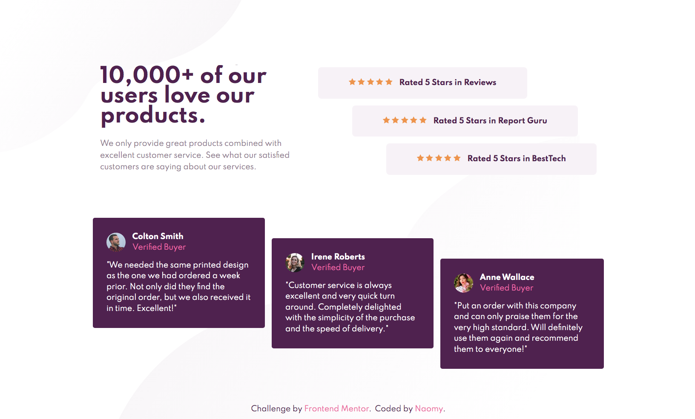
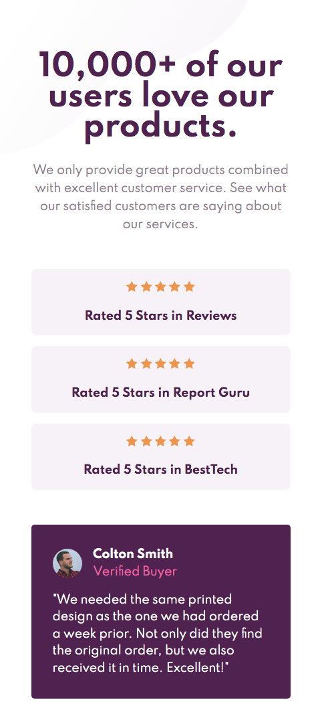

<h1 align="center">
   💻 <a href="#"> SOCIAL PROOF SECTION </a>
</h1>

<h3 align="center">
    Front-end coding challenge from Frontend Mentor.
</h3>
<h4 align="center"> 
	 Status: Finished
</h4>

 <a href="#about">About</a> •
 <a href="#features">Features</a> •
 <a href="#layout">Layout</a> • 
 <a href="#built-with">Built with</a> • 
 <a href="#author">Author</a> 

## About

This is a solution to the [Social proof section challenge on Frontend Mentor](https://www.frontendmentor.io/challenges/social-proof-section-6e0qTv_bA)
 
Live Site URL: https://naomy19.github.io/social-proof-section/
 

## Features

- [x] Users should be able to view the optimal layout for the section depending on their device's screen size.
 

## Layout

  

  

 

## Built with

- Semantic HTML5 markup;
- CSS custom properties;
- Flexbox;
- Mobile-first workflow.
 

## Author

<a href="https://github.com/naomy19">
 
  
 <b>Camilla Naomy Tsuda</b></a> 
  

 

- Frontend Mentor - [@naomy19](https://www.frontendmentor.io/profile/naomy19)
